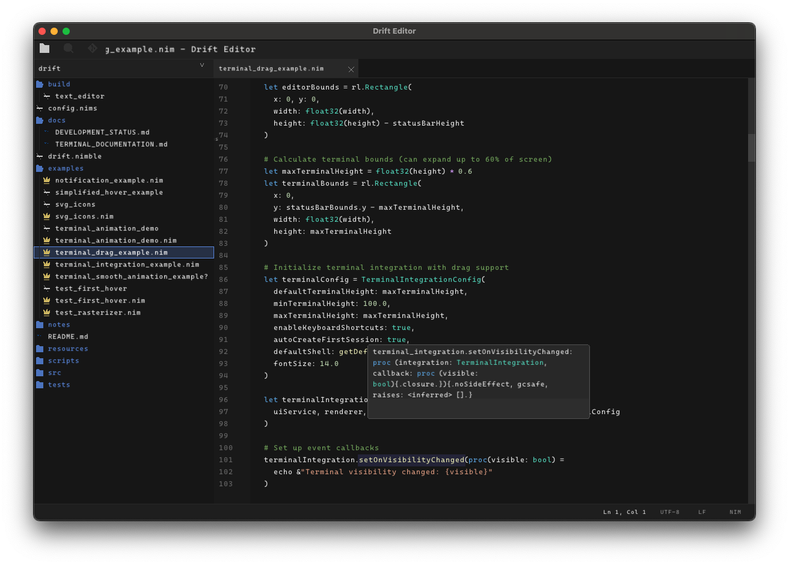

# Drift Editor

A lightweight, fast text editor written in Nim using Raylib. Folx features a clean, minimal architecture with syntax highlighting, file exploration, and a modern dark theme.

  

## Features

- **Fast & Lightweight**: Minimal dependencies, quick startup
- **Syntax Highlighting**: Support for Nim and common languages
- **File Explorer**: Built-in directory navigation
- **Modern UI**: Dark theme with clean, flat design
- **High-DPI Support**: Crisp rendering on high-resolution displays
- **Git Integration**: Basic git status and branch display
- **Auto-save**: Automatic backup creation
- **Notifications**: In-app notification system

## Architecture

The codebase has been refactored into a clean, layered architecture with proper separation of concerns:

```
drift/
├── src/
│   ├── main.nim                          # Clean entry point
│   ├── shared/                           # ✅ Foundation layer
│   │   ├── types.nim                     # Domain types & Result pattern
│   │   ├── constants.nim                 # Application constants
│   │   ├── errors.nim                    # Error handling system
│   │   └── utils.nim                     # Pure utility functions
│   ├── infrastructure/                   # ✅ External dependencies
│   │   ├── rendering/
│   │   │   └── theme.nim                 # Theme & color management
│   │   ├── input/
│   │   │   ├── keyboard.nim              # Keyboard abstraction
│   │   │   ├── mouse.nim                 # Mouse abstraction
│   │   │   └── input_handler.nim         # Unified input coordination
│   │   ├── filesystem/
│   │   │   ├── file_watcher.nim          # Async file operations
│   │   │   └── path_utils.nim            # Cross-platform paths
│   │   ├── external/
│   │   │   ├── lsp_client.nim            # LSP protocol client
│   │   │   └── git_client.nim            # Git operations
│   │   └── config.nim                    # Configuration management
│   ├── domain/                           # 🚧 Business logic (Phase 3)
│   ├── services/                         # 📋 Coordination layer (Phase 4)
│   ├── app/                              # 📋 Application layer (Phase 5)
│   └── legacy/                           # 🔄 Legacy modules being migrated
│       ├─ drift.nim                     # Old entry point
│       ├── core.nim                      # Legacy types
│       ├── ui.nim                        # Legacy UI
│       └── editor.nim                    # Legacy editor
├── notes/                                # 📚 Development documentation
│   ├── README.md                         # Documentation index
│   ├── ARCHITECTURE.md                   # Architecture overview
│   ├── IMPLEMENTATION_STATUS.md          # Current status
│   ├── UI_COMPONENTS.md                  # UI component details
│   ├── EXPLORER_SYSTEM.md                # File explorer details
│   ├── ICON_SYSTEM.md                    # Icon system details
│   ├── LSP_INTEGRATION.md                # LSP integration details
│   ├── PERFORMANCE_GUIDE.md              # Performance guidelines
│   ├── REFACTORING_GUIDE.md              # Refactoring process
│   ├── MODULAR_REFACTORING.md            # Modular refactoring
│   ├── VIRTUAL_PADDING.md                # Virtual padding implementation
│   └── FEATURE_COMPLETION.md             # Feature completion summaries
├── README.md
└── drift.nimble
```

### New Layered Architecture

```
┌─────────────────────────────────────────────────────────────────────────────┐
│                          Application Layer (Phase 5)                        │
│  ┌─────────────────┐  ┌─────────────────┐  ┌─────────────────────────────┐  │
│  │  Application    │  │  Event          │  │  Command                    │  │
│  │  Controller     │  │  Coordinator    │  │  Dispatcher                 │  │
│  └─────────────────┘  └─────────────────┘  └─────────────────────────────┘  │
└─────────────────────────────────────────────────────────────────────────────┘
                                      │
                                      ▼
┌─────────────────────────────────────────────────────────────────────────────┐
│                           Service Layer (Phase 4)                           │
│  ┌─────────────────┐  ┌─────────────────┐  ┌─────────────────────────────┐  │
│  │  Editor         │  │  File           │  │  Language                   │  │
│  │  Service        │  │  Service        │  │  Service                    │  │
│  └─────────────────┘  └─────────────────┘  └─────────────────────────────┘  │
│  ┌─────────────────┐  ┌─────────────────┐  ┌─────────────────────────────┐  │
│  │  UI             │  │  Layout         │  │  Notification               │  │
│  │  Service        │  │  Service        │  │  Service                    │  │
│  └─────────────────┘  └─────────────────┘  └─────────────────────────────┘  │
└─────────────────────────────────────────────────────────────────────────────┘
                                      │
                                      ▼
┌─────────────────────────────────────────────────────────────────────────────┐
│                          Domain Layer (Phase 3)                             │
│  ┌─────────────────┐  ┌─────────────────┐  ┌─────────────────────────────┐  │
│  │  Document       │  │  Selection      │  │  Syntax                     │  │
│  │  Model          │  │  Model          │  │  Model                      │  │
│  └─────────────────┘  └─────────────────┘  └─────────────────────────────┘  │
│  ┌─────────────────┐  ┌─────────────────┐  ┌─────────────────────────────┐  │
│  │  Project        │  │  LSP            │  │  Git                        │  │
│  │  Model          │  │  Model          │  │  Model                      │  │
│  └─────────────────┘  └─────────────────┘  └─────────────────────────────┘  │
└─────────────────────────────────────────────────────────────────────────────┘
                                      │
                                      ▼
┌─────────────────────────────────────────────────────────────────────────────┐
│                      ✅ Infrastructure Layer (Complete)                     │
│  ┌─────────────────┐  ┌─────────────────┐  ┌─────────────────────────────┐  │
│  │  Rendering      │  │  Input          │  │  File System                │  │
│  │  Engine         │  │  Handler        │  │  Adapter                    │  │
│  └─────────────────┘  └─────────────────┘  └─────────────────────────────┘  │
│  ┌─────────────────┐  ┌─────────────────┐  ┌─────────────────────────────┐  │
│  │  Config         │  │  Resources      │  │  External APIs              │  │
│  │  Manager        │  │  Manager        │  │  (Git, LSP)                 │  │
│  └─────────────────┘  └─────────────────┘  └─────────────────────────────┘  │
└─────────────────────────────────────────────────────────────────────────────┘
                                      │
                                      ▼
┌─────────────────────────────────────────────────────────────────────────────┐
│                       ✅ Shared Foundation (Complete)                       │
│  ┌─────────────────┐  ┌─────────────────┐  ┌─────────────────────────────┐  │
│  │  Types &        │  │  Constants &    │  │  Error Handling &           │  │
│  │  Results        │  │  Configuration  │  │  Utilities                  │  │
│  └─────────────────┘  └─────────────────┘  └─────────────────────────────┘  │
└─────────────────────────────────────────────────────────────────────────────┘
```

### UI Layout

```
┌────────────────────────────────────────────────────────────────────────────┐
│ [Explorer] [Search] [Git] [Ext] │ ▓ main.nim ▓ utils.nim ✕ │ Drift Editor                                                  │
├────────────────────────────────────────────────────────────────────────────┤
│ dir_base_name             │ main.nim                                                                                         │
│ ┌─ src/                  │───────────────────────────────────────────────────────────│
│ │  ├─ main.nim          │  1 │ func main() =                            ││                                               │
│ │  └─ ui/               │  2 │   echo "Hello"                           ││                                               │
│ │                        │  3 │   return 0                               ││                                                │
│ │                        │  4 │                                          ││                                                │
│ │                        │  5 │                                          ││                                                │
│ │                        │    │                                          ││                                                │
│                           │    │                                          ││                                                │
├──────────────────────────┴─────────────────────────────────────────────────┤
│ ● Modified     ⎇ main                                                                            Ln 1, Col 1    UTF-8 LF  Nim│
└────────────────────────────────────────────────────────────────────────────┘
```

## Main Logic Flow

### 1. Initialization
```
main() → initializeApplication() → {
  - Initialize Raylib window
  - Load default font
  - Initialize editor state
  - Setup UI components
  - Handle command line arguments
}
```

### 2. Main Loop
```
runMainLoop() → {
  while not shouldClose:
    - Handle window resize
    - Calculate layout bounds
    - Process input events
    - Update editor state
    - Update syntax highlighting
    - Update git info
    - Check auto-save
    - Render frame
}
```

### 3. Input Flow
```
handleInput() → {
  Mouse Input → {
    - Button clicks (sidebar panels)
    - Sidebar resizing
    - File explorer navigation
    - Text editor positioning
    - Scrolling
  }

  Keyboard Input → {
    - Character input → insertChar()
    - Special keys → {
      - Enter → insertLine()
      - Backspace → deleteChar()
      - Arrows → cursor movement
      - Ctrl+S → saveFile()
      - Ctrl+O → openFile()
      - Ctrl+N → newFile()
    }
  }
}
```

### 4. Rendering Pipeline
```
render() → {
  calculateLayout() → {
    - Title bar bounds
    - Sidebar bounds
    - Editor bounds
    - Status bar bounds
  }

  Draw Components → {
    - drawTitleBar()
    - drawSidebar() (Explorer/Search/Git/Extensions)
    - drawTextEditor() (with syntax highlighting)
    - drawStatusBar()
    - drawNotifications()
  }
}
```

### 5. Data Flow
```
EditorState (core.nim) ↔ {
  Text Operations (editor.nim) ↔ {
    - File I/O
    - Syntax highlighting
    - Search/Replace
    - Git integration
  }

  UI Operations (ui.nim) ↔ {
    - Layout calculation
    - Input handling
    - Rendering
    - Notifications
  }
}
```

## Migration Status & Architecture Progress

### ✅ **Phase 1 & 2 Complete: Foundation & Infrastructure**

**Shared Foundation** (`shared/`):
- **`types.nim`**: Clean domain types with Result pattern for error handling
- **`constants.nim`**: Centralized application constants and configuration
- **`errors.nim`**: Comprehensive error handling with user-friendly messages
- **`utils.nim`**: Pure utility functions without external dependencies

**Infrastructure Layer** (`infrastructure/`):
- **Rendering**: Complete theme system with dark/light themes, 50+ UI colors, syntax highlighting
- **Input**: Unified keyboard & mouse handling with 70+ key mappings, gestures, context awareness
- **File System**: Async file operations, cross-platform paths, file watching, caching
- **External APIs**: Full LSP client, Git operations, async communication with timeout handling
- **Configuration**: Type-safe TOML configuration with validation and environment overrides

### 🔄 **Currently Migrating: Legacy Code Integration**

**Migration Approach**:
- **`main.nim`**: New clean entry point using layered architecture
- **`editor_state.nim`**: Bridge between legacy editor and new Document model
- **Legacy modules**: Gradually migrating existing functionality to new architecture

### 📋 **Next Phases: Domain, Services & Application**

**Phase 3 - Domain Models**: Pure business logic without UI/infrastructure concerns
**Phase 4 - Service Layer**: Coordinate between domain and infrastructure
**Phase 5 - Application Layer**: Clean main loop and event handling
**Phase 6 - UI Refactoring**: Modern rendering with new theme system

## Building and Running

### Prerequisites
- Nim compiler (1.6.0 or later)
- Raylib (installed via nimble)

### Build
```bash
# Build with new architecture (migrated entry point)
nim c src/main.nim

# Or build legacy entry point (still functional during migration)
nim c src/drift.nim
```

### Usage
```bash
# Open editor with new architecture
./src/main

# Open specific file
./src/main myfile.txt

# Open directory
./src/main /path/to/directory
```

## New Architecture Benefits

### 🏗️ **Layered Design**
- **Clear Separation**: Each layer has single responsibility
- **Dependency Direction**: Clean downward dependency flow
- **Type Safety**: Strong typing with Result types throughout
- **Error Handling**: Comprehensive error system with recovery suggestions

### 🔧 **Infrastructure Abstractions**
- **Cross-Platform**: Consistent behavior across Windows, macOS, Linux
- **Async Support**: Proper async/await for I/O operations
- **Theme System**: Flexible color management with dark/light themes
- **Input Handling**: Unified keyboard/mouse with context awareness
- **File System**: Safe operations with caching and change monitoring
- **External APIs**: Clean LSP and Git client abstractions

### 📊 **Migration Progress**
```
✅ Shared Foundation (100%)    - Types, constants, errors, utilities
✅ Infrastructure (100%)       - Rendering, input, filesystem, external APIs
🔄 Legacy Integration (60%)    - Migrating existing code to new architecture
📋 Domain Models (0%)          - Pure business logic extraction
📋 Service Layer (0%)          - Coordination and state management
📋 Application Layer (0%)      - Main loop and event handling
📋 UI Refactoring (0%)         - Modern rendering with new theme system
```

### 🎯 **Current Capabilities**
- **New Entry Point**: `main.nim` using clean architecture
- **Theme Management**: Dark/light themes with 50+ color definitions
- **Input System**: Context-aware keyboard/mouse handling
- **File Operations**: Async I/O with proper error handling
- **Configuration**: Type-safe TOML config with validation
- **Git Integration**: Repository detection and status tracking
- **LSP Support**: Language server protocol client (foundation ready)

# AI Code Assistant Binding Notes (for raylib in Nim)

This project uses a **Nim binding for raylib** that differs from the original C API:

## 🔧 General Rules

- The Nim binding uses **function overloading** instead of separate `*Ex` functions.
- Do **not use** any `*Ex` function names like `drawTextEx`, `measureTextEx`, `loadFontEx`, etc.
- Use the **overloaded base name**, and provide correct parameters.

### ✅ Correct Examples:

```nim
# drawTextEx → drawText with Vector2 and spacing
drawText("Text", Vector2(x: 10, y: 10), 20.0, 2.0, BLACK)

# measureTextEx → measureText with full args
measureText(font, "Hello", 24.0, 2.0)

# loadFontEx → just use loadFont if no overload exists
loadFont("MyFont.ttf")

## Handling types without `=copy` hooks
Some types in naylib, like `Texture`, don't have `=copy` hooks. This prevents direct copying:

```nim
let texture = loadTexture("resources/example.png")
let copy = texture  # Error: '=copy' is not available for type <Texture>
To work around this, use references:
```

```nim
var texture: ref Texture
new(texture)
texture[] = loadTexture("resources/example.png")
let copy = texture  # This works, copying the reference
```

## Contributing

The new layered architecture makes development much easier:

### 🎯 **Clear Development Guidelines**
- **Infrastructure Layer**: Add new external dependencies, input methods, rendering features
- **Domain Layer**: Pure business logic for documents, selections, syntax parsing
- **Service Layer**: Coordinate between domain and infrastructure
- **Application Layer**: High-level application flow and event handling

### 🔧 **Development Workflow**
1. **New Features**: Start with domain models, add service coordination, expose via application layer
2. **External Integration**: Add infrastructure abstractions, then domain models, then services
3. **UI Changes**: Update rendering in infrastructure, coordinate through services
4. **Bug Fixes**: Identify layer, fix with proper error handling and tests

### 📋 **Current Priorities**
1. **Complete Legacy Migration**: Finish integrating existing code
2. **Domain Models**: Extract pure business logic (Document, Selection, Syntax)
3. **Service Layer**: Create coordination services (Editor, File, Language, UI)
4. **Testing**: Add comprehensive tests for each layer
5. **Documentation**: Complete API documentation for each layer

### 🎨 **Architecture Principles**
- **Single Responsibility**: Each module has one clear purpose
- **Dependency Direction**: Only depend on lower layers
- **Type Safety**: Use Result types for all operations that can fail
- **Error Handling**: Comprehensive error types with user-friendly messages
- **Async Support**: Use async/await for I/O operations
- **Configuration**: Type-safe configuration with validation
- **Testing**: Each layer should be independently testable
# drift
